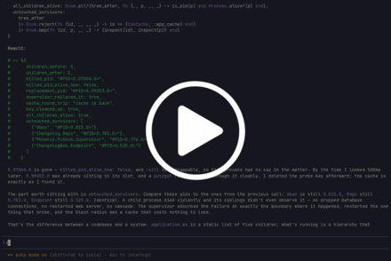
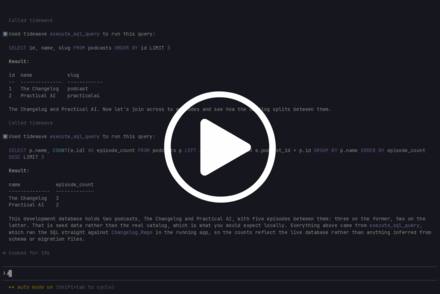
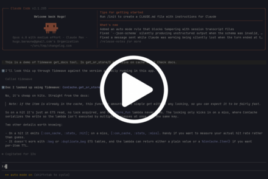
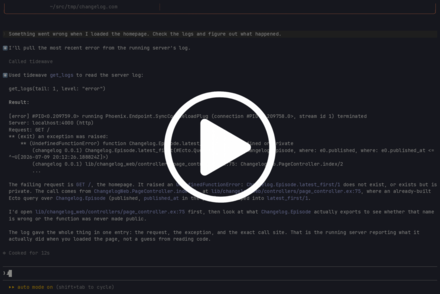
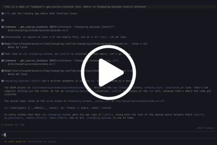

# Tidewave Phoenix

Tidewave Phoenix is an MCP server that provides runtime-level tools for developing Phoenix apps using coding agents.

Your agent will be able to use this MCP server to talk to your running Phoenix app in development to:

- execute code in the context of the running app (like an IEx session for agents)
- read the app's live logs
- query your development database
- get source locations of modules and functions
- read documentation pinned to the exact hex package versions your project depends on

This MCP server is an open-source component of [Tidewave](https://tidewave.ai), the agentic development environment for Phoenix and Rails.

You can use this project as a standalone MCP server or integrated with the [Tidewave product](https://tidewave.ai) by following the installation instructions below.

## Installation

### 1. Add the Tidewave hex package to your app

#### Option 1: Manually

Add the `tidewave` package to your `mix.exs`:

```elixir
def deps do
  [
    {:tidewave, "~> 0.6", only: :dev},
    {:phoenix, ...},
  ]
end
```

Then, for Phoenix applications, go to your `lib/my_app_web/endpoint.ex` and right above the `if code_reloading? do` block, add:

```diff
+  if Mix.env() == :dev do
+    plug Tidewave
+  end

   if code_reloading? do
```

> [!TIP]
> Tidewave works best with Phoenix LiveView v1.1 or later. Once you update it,
> make sure to enable the following options in your `config/dev.exs`:
>
> ```elixir
> config :phoenix_live_view,
>   debug_heex_annotations: true,
>   debug_attributes: true
> ```
>
> Those are enabled by default for Phoenix v1.8+ apps.

#### Option 2: Using Igniter

Alternatively, you can use `igniter` to automatically install Tidewave MCP into an existing Phoenix application:

```sh
# install igniter_new if you haven't already
mix archive.install hex igniter_new

# install tidewave
mix igniter.install tidewave
```

#### Umbrella projects

For umbrella projects, you can follow the manual steps above in the application that defines your Phoenix endpoint (typically `apps/your_app_web`).

#### In non-Phoenix applications

Tidewave can be used as a MCP in any Elixir project. For example, you can use `bandit` (and `tidewave`) in dev mode in your `mix.exs`:

```elixir
{:tidewave, "~> 0.6", only: :dev},
{:bandit, "~> 1.0", only: :dev},
```

And then adding an alias in your `mix.exs`:

```elixir
aliases: [
  tidewave:
    "run --no-halt -e 'Agent.start(fn -> Bandit.start_link(plug: Tidewave, port: 4000) end)'"
]
```

Now run `mix tidewave`

### 2. Add the Tidewave MCP to your agent/editor

Add the Tidewave MCP server to your editor or MCP client configuration as the type "http" (streamable), pointing to the `/tidewave/mcp` path and port your web application is running at. For example, `http://localhost:4000/tidewave/mcp`.

We also have specific instructions for:

- [Claude Code](https://tidewave.hexdocs.pm/mcp_claude_code.html)
- [Codex](https://tidewave.hexdocs.pm/mcp_codex.html)
- [Cursor](https://tidewave.hexdocs.pm/mcp_cursor.html)
- [Neovim](https://tidewave.hexdocs.pm/mcp_neovim.html)
- [OpenCode](https://tidewave.hexdocs.pm/mcp_opencode.html)
- [VS Code](https://tidewave.hexdocs.pm/mcp_vscode.html)
- [Others](https://tidewave.hexdocs.pm/mcp.html)

> [!TIP]
> If you are using worktrees, you are likely running your web server
> on different ports, and therefore there isn't a single host and port
> combo you can use.
>
> In such cases, you may want to add `mix tidewave.proxy` as STDIO MCP
> instead, which adds a "port" parameter to all tool definitions, and
> is responsible to dispatch to the correct application.

## Usage

As with any other MCP server, your agent will call the tools exposed by the Tidewave MCP whenever it sees fit. But you can also prompt it to call them explicitly.

## Available MCP tools

### `project_eval`

Evaluates Elixir code within your running application, giving the agent access to your runtime, dependencies, and in-memory data. It's like an IEx for the agent.

[](https://asciinema.org/a/1260494)

Your agent can use it when it would rather run code than assume behavior, grounding its next step in what the running app actually does. For example, calling a function to see what comes back or reproducing a failing code path against live app state to debug it.

### `execute_sql_query`

Executes a SQL query within your app's development database.

[](https://asciinema.org/a/1260504)

Your agent can use it to run any SQL against your development database. Useful for the agent to verify the result of an action.

### `get_docs`

Get the documentation for a given module/function. It consults the exact versions locked in your project's mix.lock, ensuring you get correct information.

[](https://asciinema.org/a/1260511)

### `get_logs`

Reads logs written by the server.

[](https://asciinema.org/a/1260515)

Your agent can use it to see what happened after a request. For example, reading the request log and backtrace when something misbehaves.

### `get_source_location`

Get the source location for a given module/function, across both your app and its dependencies.

[](https://asciinema.org/a/1260518)

Your agent can use it to jump straight to where a module/function is defined, by file and line, instead of grepping for it, including when the definition lives in a hex dependency.

## Troubleshooting

### Using multiple hosts/subdomains

If you are using multiple hosts/subdomains during development, you must use `*.localhost`, as such domains are considered secure by browsers. Additionally, add the following immediately `@session_options` definition in your `lib/your_app_web/endpoint.ex`:

```elixir
@session_options [
  # ... your configuration
]

if code_reloading? do
  @session_options Keyword.merge(@session_options, same_site: "None", secure: true)
end
```

The above will allow your application to run embedded within Tidewave across multiple subdomains, as long as it is using a secure context (such as `admin.localhost`, `www.foobar.localhost`, etc).

### Content security policy

If you have enabled Content-Security-Policy, Tidewave will automatically enable "unsafe-eval" under `script-src` in order for contextual browser testing to work correctly. It also disables the `frame-ancestors` directive. This is done only in the environments that Tidewave is loadead (development by default).

## Configuration

You may configure the `Tidewave` plug using the following syntax:

```elixir
  plug Tidewave, options
```

The following options are available:

  * `:allow_remote_access` - Tidewave only allows requests from localhost by default, even if your server listens on other interfaces, for security purposes. Read [our security guidelines for more information and when to allow remote access](https://tidewave.hexdocs.pm/security.html) (if you know what you are doing)

  * `:allowed_origins` - a list of values matched against the `Origin` header to prevent cross origin and DNS rebinding attacks. Each value must be a string of shape `[scheme:]//host[:port]`, where both scheme and port are optional. The host may also start with "*". Example: `["//localhost:8000", "//*.test"]`

  * `:inspect_opts` - custom options passed to `Kernel.inspect/2` when formatting some tool results. Defaults to: `[charlists: :as_lists, limit: 50, pretty: true]`

  * `:team` - set your Tidewave Team configuration, such as `team: [id: "my-company"]`

  * `:toolbar` - controls whether the Tidewave toolbar is injected into your HTML pages. Defaults to `true`

  * `tmp_dir` - temporary directory Tidewave uses for screenshots and recordings. It must be a relative directory to the current application root. Defaults to `tmp`, storing files under `tmp/tidewave/screenshots` and `tmp/tidewave/recordings`

## License

Copyright (c) 2025 Dashbit

Licensed under the Apache License, Version 2.0 (the "License");
you may not use this file except in compliance with the License.
You may obtain a copy of the License at [http://www.apache.org/licenses/LICENSE-2.0](http://www.apache.org/licenses/LICENSE-2.0)

Unless required by applicable law or agreed to in writing, software
distributed under the License is distributed on an "AS IS" BASIS,
WITHOUT WARRANTIES OR CONDITIONS OF ANY KIND, either express or implied.
See the License for the specific language governing permissions and
limitations under the License.
