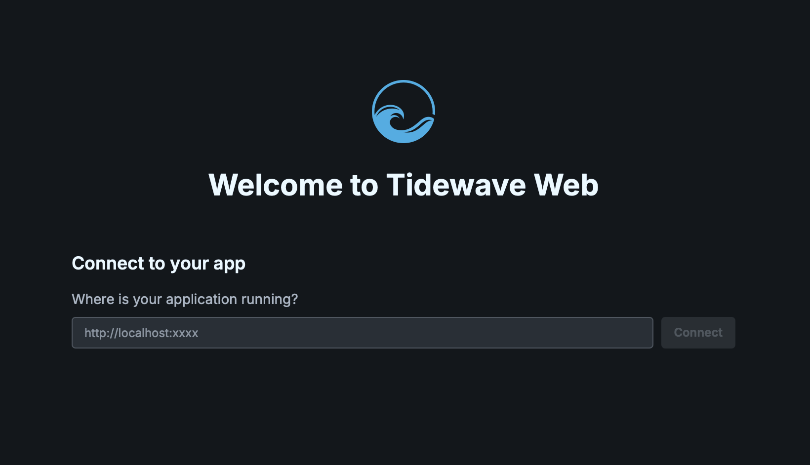

# Installation

Tidewave is a coding agent that runs in the browser alongside your web application, deeply integrated with your web framework. [See our website](https://tidewave.ai) for more information.

## Installing the app

To get started with Tidewave, download our desktop app:

* For macOS: [Apple Silicon](https://github.com/tidewave-ai/tidewave_app/releases/latest/download/tidewave-app-aarch64.dmg), [Intel](https://github.com/tidewave-ai/tidewave_app/releases/latest/download/tidewave-app-x64.dmg)
* For Windows: [Windows](https://github.com/tidewave-ai/tidewave_app/releases/latest/download/tidewave-app-x64.exe)
* For Linux: [AppImage](https://github.com/tidewave-ai/tidewave_app/releases/latest/download/tidewave-app-amd64.AppImage)

For advanced users, you can use the `tidewave` CLI instead.

## Running Tidewave

After installation, you can run the Tidewave application. By default, it will run a service on [`http://localhost:9832`](http://localhost:9832), which you can acess from your favorite browser. Once you do, you will be greeted with this screen:

Then you can put the address of your web application and Tidewave will connect to it. If your web application was not yet configured with Tidewave, you will be prompted to do so, using the links below:

* [Tidewave for Django](https://github.com/tidewave-ai/tidewave_python#django)
* [Tidewave for FastAPI](https://github.com/tidewave-ai/tidewave_python#fastapi)
* [Tidewave for Flask](https://github.com/tidewave-ai/tidewave_python#flask)
* [Tidewave for Next.js](https://github.com/tidewave-ai/tidewave_js#nextjs)
* [Tidewave for Phoenix](https://github.com/tidewave-ai/tidewave_phoenix)
* [Tidewave for Ruby on Rails](https://github.com/tidewave-ai/tidewave_rails)
* [Tidewave for React](https://hexdocs.pm/tidewave/react.html)

The Tidewave app will remain running on your menu bar (top right on macOS/Linux, bottom right on Windows), you can click it to open up, configure, and update Tidewave.

## CLI

For advanced users, or for running Tidewave inside containers, a CLI is also available:

* For macOS: [Apple Silicon](https://github.com/tidewave-ai/tidewave_app/releases/latest/download/tidewave-cli-aarch64-apple-darwin), [Intel](https://github.com/tidewave-ai/tidewave_app/releases/latest/download/tidewave-cli-x86_64-apple-darwin)
* For Windows: [Windows](https://github.com/tidewave-ai/tidewave_app/releases/latest/download/tidewave-cli-x86_64-pc-windows-msvc.exe)
* For Linux: [aarch64-gnu](https://github.com/tidewave-ai/tidewave_app/releases/latest/download/tidewave-cli-aarch64-unknown-linux-gnu), [aarch64-musl](https://github.com/tidewave-ai/tidewave_app/releases/latest/download/tidewave-cli-aarch64-unknown-linux-gnu), [x86_64-gnu](https://github.com/tidewave-ai/tidewave_app/releases/latest/download/tidewave-cli-x86_64-unknown-linux-gnu), [x86_64-musl](https://github.com/tidewave-ai/tidewave_app/releases/latest/download/tidewave-cli-x86_64-unknown-linux-gnu)

Once the CLI is installed, run it with `./tidewave`. Run `./tidewave --help` for options.
